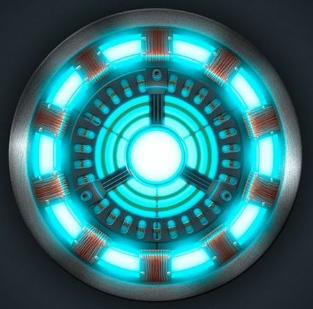

# InstaFreeHeart

> 钢铁侠胸口反应堆造型 · 可佩戴 · 充电宝 + AI 摄像 + 录音日记
>
> **Mark I 圆形特斯拉款（最终方案）：Ø90 × 15 mm · 136 g · 4000 mAh · Halbach 磁吸**



---

## 项目简介

InstaFreeHeart 是一款外形参考钢铁侠 **Mark I 圆形特斯拉反应堆** 的可穿戴智能设备
（同心 4 环 + 8 段蓝光灯柱 + 8 颗铜线圈 + Y 字三支撑）。
功能源自 [`userstory/userstory.md`](userstory/userstory.md)，从用户故事拆解出硬件，
逐步给出选型、引脚、电源拓扑、SKiDL 网表与 3D 模型。

## 整机参数

| 项 | 数值 |
|----|------|
| 外形 | 圆盘 Ø90 × 15 mm |
| 重量 | 136 g（含电池 + 散热 + 降噪辅件） |
| 电池 | 4000 mAh / 14.8 Wh（2× 2000 mAh 软包并联，DW01A + 8205A 保护） |
| 充手机能力 | iPhone 充至 ~65%（一次） |
| 续航（纯日记模式） | 5.3–7.1 天连续工作 |
| 续航（高强度模式） | 9.8–13 h 连续工作 |
| 续航（待机/Deep Sleep） | 6–8 个月 |
| 磁吸 | 中央 N52 Φ22×4 + 4× Φ8×2 周边（Halbach-like） |
| 贴衣拉力 | ~ 2.4 kg（安全系数 2.2×） |
| 后壳贴肤 | 0.5 mm 硅胶垫，μ ≈ 0.6 |
| 灯环 | 16 颗 WS2812B-2020（外圈 8 颗 Ø35 mm + 内圈 8 颗 Ø12 mm 双同心环） |
| 装饰件 | 8 颗 SLA 打印铜色线圈 |
| 皮肤接触温度 | 正常 38 ℃ / 最坏 40.7 ℃（限功率后） |
| BOM 总价 | ≈ ¥133 / 台 |

## 核心能力

| # | 能力 | 关键硬件 |
|---|------|---------|
| 1 | USB-C 充电宝 (5V/1A 输出) | IP5306 + 锂聚电池 + USB-C |
| 2 | 磁吸佩戴 | N52 钕磁铁 + 钢质吸片 |
| 3 | 钢铁侠环形发光 | 16 颗 WS2812B-2020 |
| 4 | **HDR 夜景拍摄 → AI 日记** | OV5640 (硬件 HDR) + Mertens 软件融合 + ESP32-S3 |
| 5 | WiFi/BLE 上传 | ESP32-S3 内置射频 |
| 6 | 本地 LLM + 离散图片合成日记 | ESP32-S3 (8 MB PSRAM) + microSD |
| 7 | **双麦差分降噪 + 1s 阈值录音存档** | 双 INMP441 + Gore-Tex 防风罩 + WebRTC NSx |
| 8 | **散热闭环温控** | ADS1115 + 3 NTC + 石墨烯膜 + 导热硅胶垫 |
| 9 | **高效电源** | SY8088 Buck (3V3 路径 η=92%) |

## 仓库结构

```
InstaFreeHeart/
├── README.md
├── 898b908eeca3d8b0d72bd0f4745d17cf.jpeg        参考造型（Mark I 圆形）
│
├── userstory/
│   └── userstory.md                              用户需求
│
├── hardware/                                     电气设计
│   ├── requirements.md                           用户故事 → 硬件能力 拆解
│   ├── bom.md                                    BOM（含嘉立创/LCSC 料号）
│   ├── pin_mapping.md                            ESP32-S3 GPIO 详细分配
│   ├── power_tree.md                             电源拓扑、充放策略、BMS
│   ├── schematic.py                              SKiDL 主原理图
│   ├── lib/parts.py                              SKiDL 自定义零件模板
│   └── output/
│       ├── instafreeheart.net                    KiCad 兼容网表
│       └── instafreeheart.xml                    KiCad 兼容 XML
│
├── mechanical/                                   结构设计
│   ├── 3d_design.md                              3D 建模思路
│   ├── thermal.md                                散热设计
│   ├── power_budget.md                           功耗预算与续航
│   └── openscad/
│       ├── parameters.scad                       全局尺寸（改一处即改全机）
│       ├── instafreeheart.scad                   主装配文件（OpenSCAD F5/F6）
│       ├── preview.py                            Python 多视图预览
│       ├── thermal_preview.py                    散热可视化
│       ├── power_preview.py                      功耗可视化
│       ├── README.md                             OpenSCAD 安装与渲染指南
│       └── out/                                  全部生成的预览/分析图
│
└── firmware/                                     固件 demo（ESP-IDF）
    ├── README.md
    ├── thermal_guard.c                           散热守卫（NTC + 状态机）
    ├── diary_mode.c                              Light Sleep 调度器
    ├── hdr_pipeline.c                            软件 HDR (Mertens fusion)
    ├── hdr_pipeline.md                           HDR pipeline 文档
    └── audio_denoise.md                          双麦差分 + WebRTC NSx 集成
```

## 主要硬件选型

| 子系统 | 方案 | 嘉立创料号 |
|-------|------|-----------|
| 主控 | ESP32-S3-WROOM-1-N16R8 | C2913204 |
| 摄像头 | OV5640 (DVP, 5MP, 硬件 HDR) | C44391 |
| 麦克风 | INMP441 ×2 (I²S MEMS, 立体声差分) | C126667 |
| 充放管理 | IP5306 | C71064 |
| 电量计 | CW2015 | C113566 |
| 3V3 主电源 | **SY8088** (1.5 MHz Buck, η=92%) | C36420 |
| 温度采集 | ADS1115 + 3× NTC 10K B3950 | C37593 + C58436 |
| LED | WS2812B-2020 × 16 | C2761815 |
| TF 卡座 | microSD Push-Push | C701637 |
| USB-C | TYPE-C-31-M-12 | C165948 |
| ESD | USBLC6-2SC6 | C7519 |

详见 [`hardware/bom.md`](hardware/bom.md)。

## 工作流

```
┌─────────────┐     ┌────────────┐     ┌────────────────┐     ┌──────────────┐
│ ① 拆解需求   │ ──> │ ② 硬件选型  │ ──> │ ③ SKiDL 描述电路 │ ──> │ ④ ERC + 网表 │
│ requirements│     │ bom.md     │     │ schematic.py   │     │ output/*.net │
└─────────────┘     └────────────┘     └────────────────┘     └──────┬───────┘
                                                                      │
                                                                      ▼
       ┌──────────────┐     ┌──────────────┐     ┌──────────────┐
       │ ⑦ 固件实现    │ <── │ ⑥ 散热/功耗  │ <── │ ⑤ 机械建模    │
       │ firmware/    │     │ thermal+pwr  │     │ openscad/    │
       └──────────────┘     └──────────────┘     └──────────────┘
```

## 运行 SKiDL

```bash
pip3 install --user skidl
cd InstaFreeHeart
PYTHONPATH=hardware python3 hardware/schematic.py
```

输出：`hardware/output/instafreeheart.net` + `.xml`，**ERC: 0 errors / 0 warnings**。

## 生成预览图

```bash
cd mechanical/openscad
python3 preview.py            # 5 张 3D 模型预览图
python3 thermal_preview.py    # 散热设计可视化
python3 power_preview.py      # 功耗预算 + 续航可视化
```

## 下一步

1. 在 KiCad 中导入 `hardware/output/instafreeheart.net` → 双面 1.6 mm PCB → 嘉立创下单
2. 用 OpenSCAD 渲染 `mechanical/openscad/instafreeheart.scad` → STL → PETG 0.2 mm 层高 3D 打印
3. 把 `firmware/*.c` 加入 ESP-IDF 工程，按 [`firmware/README.md`](firmware/README.md) 集成
